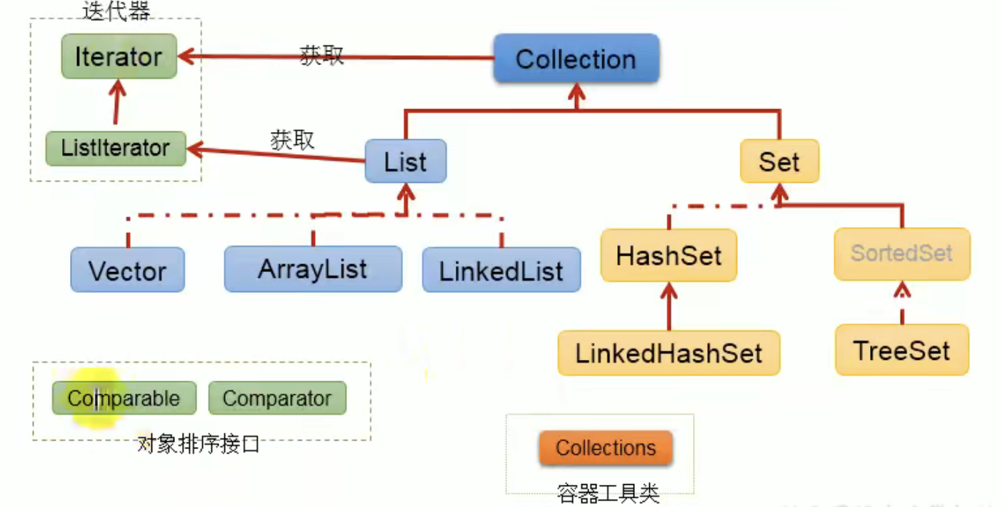
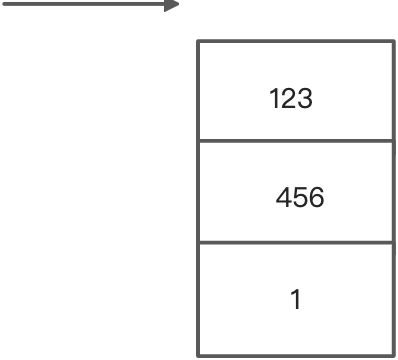
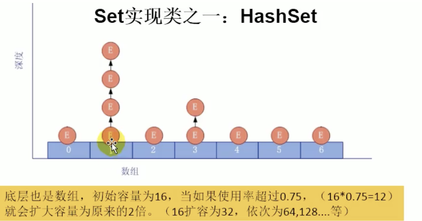
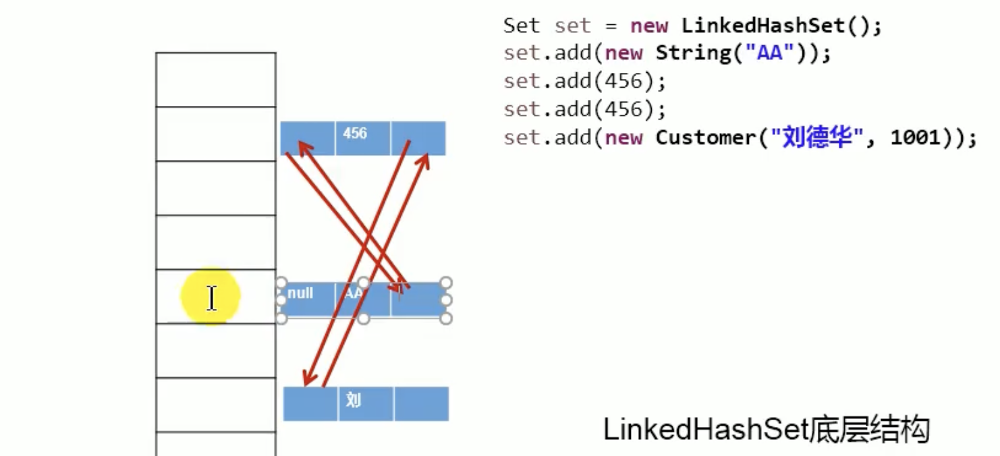
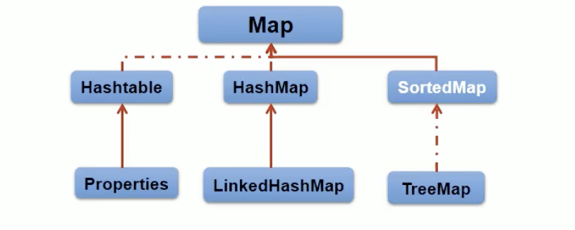

# Collection


## Collection：单列数据 定义了存储一组对象的方法的集合

**List**接口有序 可重复的数据集合 动态数组

- ArrayList 主要实现类 线程不安全 效率低 底层使用Object\[] 存储 elementData

```java
    public void testString() {
        Collection coll = new ArrayList();
        coll.add(123);
        coll.add(345);

        Collection coll1 = new ArrayList();
        coll1.add(345);
        coll1.add(123);
        System.out.println(coll.equals(coll1)); // false ArrayList 根顺序也有关

    }
```

- LinkedList 对于频繁的插入 删除操作 使用此类效率比ArrayList效率高 **底层使用双向链表存储**
- Vector 古老实现类 线程安全 效率低 底层使用Object\[] 存储

```java
    @Test
    public void testCollection() {
        Collection coll = new ArrayList();

        coll.add(1);
        coll.add(1L);
        coll.add(new Date());
        // size()  集合中元素的个数
        System.out.println(coll.size());
        // coll.toString()
        // [1, 1, Wed Feb 09 08:45:16 CST 2022]
        System.out.println(coll);

        // isEmpty 判断集合是否为空
        System.out.println(coll.isEmpty());
        // clear() 清空集合元素
        coll.clear();
        // []
        System.out.println(coll);
    }
```


## ArrayList源码分析

```java
// 构造器
public ArrayList() {
    // new ArrayList 的时候 先默认赋值为一个空的常量
        this.elementData = DEFAULTCAPACITY_EMPTY_ELEMENTDATA;
    }


private static final Object[] DEFAULTCAPACITY_EMPTY_ELEMENTDATA = {};


// 如果调用add
public boolean add(E e) {
        modCount++;
        add(e, elementData, size);
        return true;
    }

// 执行这个add
 private void add(E e, Object[] elementData, int s) {
     // 如果当前存放的elementData的长度和size相同的话 则需要去扩容
        if (s == elementData.length)
            elementData = grow();
        elementData[s] = e;
        size = s + 1;
    }


private Object[] grow() {
        return grow(size + 1);
    }

private Object[] grow(int minCapacity) {
    // 扩容操作
        return elementData = Arrays.copyOf(elementData,
                                           newCapacity(minCapacity));
    }

private static final int DEFAULT_CAPACITY = 10;

 private int newCapacity(int minCapacity) {
        // overflow-conscious code
        int oldCapacity = elementData.length;
     // 新的容量为老的容量的1.5倍数
        int newCapacity = oldCapacity + (oldCapacity >> 1);
     // 如果扩容完之后的容量仍下小于最小的容量
        if (newCapacity - minCapacity <= 0) {
            if (elementData == DEFAULTCAPACITY_EMPTY_ELEMENTDATA)
                // 如果是第一次赋初始值 则比较最小的容量和 默认的容量比较
                // private static final int DEFAULT_CAPACITY = 10;
                return Math.max(DEFAULT_CAPACITY, minCapacity);
            if (minCapacity < 0) // overflow
                throw new OutOfMemoryError();
            return minCapacity;
        }
     //private static final int MAX_ARRAY_SIZE = Integer.MAX_VALUE - 8;
     // 此时的新容量已经是大于了最小的容量
     // 如果最大的容量已经超过了数组的最大的容量
        return (newCapacity - MAX_ARRAY_SIZE <= 0)
            ? newCapacity
            : hugeCapacity(minCapacity);
    }

  private static int hugeCapacity(int minCapacity) {
        if (minCapacity < 0) // overflow
            throw new OutOfMemoryError();
      // 最小需求容量已经大于了数组的长度 则用Interger的最大值
        return (minCapacity > MAX_ARRAY_SIZE)
            ? Integer.MAX_VALUE
            : MAX_ARRAY_SIZE;
    }
```


## LinkeList源码解析

```java

  public void testS() {
        List list = new LinkedList();
        list.add("123");
    }

// new LinkedList()的时候
// 构造器没有做任何操作
public LinkedList() {
    }

// 调用list.add的时候
public boolean add(E e) {
        linkLast(e);
        return true;
    }


 public boolean add(E e) {
        linkLast(e);
        return true;
    }

 void linkLast(E e) {
     //指向末尾元素
        final Node<E> l = last;
     // 新建链表节点
     // 这里完成了双链表的前置链表的指向 newNode.prev = l
        final Node<E> newNode = new Node<>(l, e, null);
     // 尾指针往后移动
        last = newNode;
        if (l == null)
            // 如果没有元素 则 头指针和尾指针指向新的newNode元素
            first = newNode;
        else
            // 前一个指针指向了新new的指针 完成链表连接
            l.next = newNode;
        size++;
        modCount++;
    }


private static class Node<E> {
        E item;
        Node<E> next;
        Node<E> prev;

        Node(Node<E> prev, E element, Node<E> next) {
            this.item = element;
            this.next = next;
            this.prev = prev;
        }
    }

--------AbstractCollection 重写了toString的方法
        public String toString() {
        Iterator<E> it = iterator();
        if (! it.hasNext())
            return "[]";

        StringBuilder sb = new StringBuilder();
        sb.append('[');
        for (;;) {
            E e = it.next();
            sb.append(e == this ? "(this Collection)" : e);
            if (! it.hasNext())
                return sb.append(']').toString();
            sb.append(',').append(' ');
        }
    }
```


## Collection的常用方法

```java
   @Test
    public void testCollection() {
        Collection coll = new ArrayList();

        coll.add(1);
        coll.add(1L);
        coll.add(new Date());
        // size()  集合中元素的个数
        System.out.println(coll.size());
        // coll.toString()
        // [1, 1, Wed Feb 09 08:45:16 CST 2022]
        System.out.println(coll);

        // isEmpty 判断集合是否为空
        System.out.println(coll.isEmpty());
        // clear() 清空集合元素
//        coll.clear();
        // []
        System.out.println(coll);
        // contains()
        coll.contains(new Date());
        // containsAll() 所有元素是否都存在于当前集合中
        // ...
        // remove()
        boolean b = coll.remove(1);
        // removeAll(Collection c) 移除两个集合中的共同的元素  求差集

        //retainAll(Collection c) 获取两个集合中的交集 并且修改当前集合为此两个集合的交集

        // hashCode()
        System.out.println(coll.hashCode());

        // 集合 ==> 数组
        Object[] arr = coll.toArray();
        for (Object obj : arr) {
            System.out.println(obj);
        }

        // 数组 ===> 集合
        List<Integer> arr2 = Arrays.asList(new Integer[]{123, 456});
        System.out.println(arr2);
    }
```


## 迭代器使用

> 注意迭代器的remove使用

```java
    @Test
    public void testString() {
        // 迭代器 Iterator
        Collection coll = new ArrayList();
        coll.add(123);
        coll.add(345);

        Collection coll1 = new ArrayList();
        coll1.add(345);
        coll1.add(123);
        System.out.println(coll.equals(coll1)); // false ArrayList 根顺序也有关
        Iterator iterator = coll1.iterator();
        while(true) {
            if(!iterator.hasNext()) {
                break;
            }
            System.out.println("iterator.next() = " + iterator.next());
        }
    }


Iterator iterator1 = coll1.iterator();
        iterator1.next();
        //  remove 可以删除集合的元素 但是是遍历过程中通过迭代器对象的remove方法 而不是直接通过集合的remove方法
        //  删除了coll1 中的第一个元素
        //  如果还没有调用next（） 或者 在上一次调用完了remove（）之后在调用remove 就报错illegalStateException
        iterator1.remove();
        while (true) {
            if (!iterator1.hasNext()) {
                break;
            }
            System.out.println("iterator1.next() = " + iterator1.next());
        }
        for(Object obj : coll1) {
            System.out.println(obj);
        }
```


# List接口方法



```java
 @Test
    public void st() {
        List<String> arr = new ArrayList<>();
        arr.add("123");
        arr.add("1234");
        arr.add("12345");
        // add(int index, E e)
        arr.add(1, "array");
        System.out.println(arr);
        List<String> arr1 = new ArrayList<>();
        arr1.add("123");
        // addAll(int index, Collection e) //
        // addAll(Collection e)
        arr1.addAll(1, arr);
        System.out.println(arr1);
        // get
        System.out.println(arr1.get(2));
        // indexOf
        // lastIndexOf
        // remove(int index) 移除指定的元素返回删除的元素
        // set
        // subList（int begin ， int end) 左闭右开
    }
```


## 注意Collection接口的remove和List接口的remove

```java
Collection接口的remove
boolean remove(Object o);
List接口的remove
E remove(int index);

如果arrayList调用的是
arr.remove(2) // 删除的是索引值
arr.move(new Integer(2)) 删除的是值
```


## 迭代器原理

```java
Iterator iterator = coll1.iterator();
```

在执行coll1.iterator() 的时候指针会在当前集合的栈空间的顶部（例如位于 - 1位置）

当执行hasNext的时候 指针下移 判断当前位置是否有元素 然后恢复指针初始位置
next 时候 指针下移 并且将下移以后的位置上的元素返回

- Iterator 仅用于遍历集合 Iterator 本身并不提供承装对象的能力 如果需要创爱你Iterator对象 则必须要有一个被迭代的组合
- 集合对象每次调用Iterator() 方法都能得到一个全新的迭代器对象 默认的指针在集合的第一个元素之前

# Set：元素无序 不重复的集合

- HashSet 作为set的主要实现类 线程不安全  可以存储null值
  - LinkedHashSet 作为hashSet的子类 遍历其内部结构时 可以按照添加的顺序遍历
- TreeSet 底层红黑树 可以按照添加对象的指定属性 进行排序

## hashSet

**无序性 ： 存储的数据在底层数组中并非按照数组的索引的顺序添加的 而是根据数据的hash值决定的**
**不可重复性： 保证添加的元素按照equals()判断时 不能返回true（调用的是元素的equals）**
**hashSet开始的数组的长度是16**
**hashSet 运用了数组和链表的结合**

## Set的无序的原因

**向hashSet添加了一个元素a 首先调用元素a所在类的hashCode()方法 计算元素a的哈希值 此哈希值接着通过某种算法计算出在HashSet底层数组中存放的位置(即 索引位置) 判断数组此位置上是否有元素**
**  如果没有其他元素 则元素a添加成功**
**如果有其他元素(或者以链表形式存在的多个元素) 则比较元素a与元素b的hash值**
**hash值不相同 则元素a添加成功**
**hash值相同 今儿调用元素a的equals方法判断是否与元素b相同**
**equals返回true 表示相同 元素添加失败**
**equals返回fasle 表示不同 元素添加成功**

> JDK7 中 添加的元素a放在数组中 指向原来的元素
> JDK8中 原来的元素指向元素a

**向Set中添加的数据 如果是一个引用类型 则其类需要去重写hashCode和equals方法**

> **相等的对象必须具有相等的散列码**



```java
new hashSet()

    // new 了一个hashMap
    public HashSet() {
        map = new HashMap<>();
    }
```


## hashCode重写

```java
// 会根据变量值的不同进行生成不同的hashCode
public int hashCode() {
        int result = num;
        result = 31 * result + (str != null ? str.hashCode() : 0);
        return result;
    }
```

> 关于为什么重写hashCode的时候会有31这个数字
>
> 1. 尽量选择饿大的系数 计算的hash地址越大 冲突就会越少 查找的效率就会越高
> 2. 31只占用了5bits 相乘造成数溢出的概率较小
> 3. 31 可以由 i * 31 = (i << 5)  - 1得到
> 4. 31是个素数 （可以有效减少冲突）


## LinkedHashSet

LinkedHashSet 作为hashSet的子类 在添加数据的同时 每个数据还维护了一对前后指针
对于频繁的遍历操作 LinkedHashSet的效率要高于hashSet


## TreeSet

TreeSet  add添加的属性必须由同一个类提供
**TreeSet比较相同调用的是compareTo()**
**TreeSet以及TreeMap采用红黑树的结构**

### 自然排序

以compareTo来排序

```java
 @Test
    public void testTreeSet() {
        TreeSet treeSet = new TreeSet();
        treeSet.add(new TestTreeSetClass(3, "12345"));
        treeSet.add(new TestTreeSetClass(2, "123"));
        treeSet.add(new TestTreeSetClass(1, "123"));
        treeSet.add(new TestTreeSetClass(1, "1234"));
        treeSet.add(new TestTreeSetClass(2, "123"));

        Iterator iterator = treeSet.iterator();
        while (iterator.hasNext()) {
            System.out.println(iterator.next());
        }

    }

    /**
     * 测试treeSet的自然排序
     */
    class TestTreeSetClass implements Comparable {
        public int number;
        public String str;

        public TestTreeSetClass() {

        }

        public TestTreeSetClass(int number, String str) {
            this.number = number;
            this.str = str;
        }


        @Override
        public int compareTo(Object o) {
            if (o instanceof TestTreeSetClass) {
                if (((TestTreeSetClass) o).number > this.number) {
                    return -1;
                } else if (((TestTreeSetClass) o).number == this.number) {
                    if (((TestTreeSetClass) o).str.equals(this.str)) {
                        return 0;
                    } else if (((TestTreeSetClass) o).str.compareTo(this.str) > 0) {
                        return -1;
                    } else return 1;
                } else {
                    return 1;
                }
            }
            return 0;
        }

        @Override
        public String toString() {
            return "TestTreeSetClass{" +
                    "number=" + number +
                    ", str='" + str + '\'' +
                    '}';
        }
```


### 定制排序

以Comparator 的对象在创建TreeSet对象时指定排序规则

```java

    @Test
    public void comparatorTestTreeSett() {
        // 倒叙排序
        Comparator comparator = new Comparator() {
            @Override
            public int compare(Object o1, Object o2) {
                if (o1 instanceof TestTreeSetClass && o2 instanceof TestTreeSetClass) {
                    if (((TestTreeSetClass) o1).number > ((TestTreeSetClass) o2).number) {
                        return -1;
                    } else if (((TestTreeSetClass) o1).number == ((TestTreeSetClass) o2).number) {
                        if (((TestTreeSetClass) o1).str.equals(((TestTreeSetClass) o2).str)) {
                            return 0;
                        } else if (((TestTreeSetClass) o1).str.compareTo(((TestTreeSetClass) o2).str) > 0) {
                            return -1;
                        } else return 1;
                    } else return 1;
                }
                throw new RuntimeException("输入类型有误");
            }
        };
        TreeSet treeSet = new TreeSet(comparator);
        treeSet.add(new TestTreeSetClass(5, "123"));
        treeSet.add(new TestTreeSetClass(2, "123"));
        treeSet.add(new TestTreeSetClass(3, "123"));
        treeSet.add(new TestTreeSetClass(4, "123"));
        treeSet.add(new TestTreeSetClass(2, "1234"));

        for (Object o : treeSet) {
            System.out.println(o);
        }
    }
```


## set添加demo

```java
  /**
     * 先比较hashCode 在比较equals
     */
    @Test
    public void test() {
        Person p1 = new Person(1001, "AA");
        Person p2 = new Person(1002, "BB");
        HashSet set = new HashSet();
        set.add(p1);
        set.add(p2);
        p1.setName("CC");
        // remove 会根据hashCode 去查找当前的值保存在哪里
        // 因为改变了name 导致了hashCode的值也改变了 则找不到原来的p1的元素位置 则无法删除成功
        set.remove(p1);
        System.out.println(set);
        set.add(new Person(1001, "CC")); // [Person{name='CC', id=1001}, Person{name='BB', id=1002}]
        // 第一个的hashCode 是根据new Person(1001,"AA") 计算出来的 所以添加cc不会覆盖
        System.out.println(set); // [Person{name='CC', id=1001}, Person{name='CC', id=1001}, Person{name='BB', id=1002}]
        // hashCode相同和第一个元素 当时equals不同
        set.add(new Person(1001,"AA"));
        System.out.println(set);
    }
```


# Map

具有key-value对的映射关系的集合

- HashMap Map的主要实现类 线程不安全 效率高 **可以存储null的key或者是value**
- LinkedHashMap **保证在遍历map元素的时候 可以按照添加的顺序实现遍历**
- TreeMap 可以保证按照添加的key-value对进行排序 可以考虑key的自然排序或者是定制排序 底层也是使用的红黑树
- Hashtable Map的以前实现类 线程安全 效率低 不能存储null的key或者是value
- Properties 常用来处理配置文件 key 和 value 都是 String类型

> 存储的hashMap为null而Hashtable不能为null的情况

```java
 @Test
    public void test() {
        HashMap map = new HashMap();
        map.put(null, null);

        Hashtable hashtable = new Hashtable();
        hashtable.put(null, null); // NullPointerException
    }
```



## Map结构的理解

Map中的key 无序的 不可重复的 使用Set存储所有的key
key 所在的类要重写equals() 和 hashCode() 以equals为例
Map中的value  无序的 可重复的 使用Collection存储所有的value
value 所在的类要重写equals()
一个键值对 key-value 构成了一个Entry对象

## hashMap底层实现

```java
HashMao map = new HashMap();

实例化以后 底层创建了长度为16的一位数组Entry[] table;

map.put(key,value);
map.put(key1,value1);
// 首先 会调用key1所在类的hashCode() 计算key1hash值 此hash值经过某种算法计算过后 得到在Entry数组中存放的位置
// 如果此位置上的数据为空 此时的key1-value1 则会被添加到数组中
// 如果此时的数据不为空 (意味着 此位置上存在一个或多个数据（以链表的形式存储） 表key1和以及存在的一个或者多个数据的hash值)：
// 如果key1的hash值与已经存在的hash值不相同 则 key1-value1添加成功
//  如果此时的key1的hash值与已经存在的hash值相同:
//  则调用key1的equals方法 如果返回true 则使用value1 替代掉原来key1映射的元素
//      如果返回的是false 则key1-value2添加成功

// 如果一位数组上原有数据 则此时会以链表的形式存储数据
// 不断添加的过程中的扩容问题 默认的扩容方式 扩容为原来的2倍 并且复制原有的数据
```

JDK8 与JDK7的不同

1. new HashMap 底层不会立即创建一个长度为16的数组
2. jdk8的底层数组是 Node\[] 而非Entry\[]
3. 首次调用put()方法时 底层创建长度为16的数组
4. jdk7底层只有数组 + 链表的结构 jdk8底层的结构是 数组 + 链表 + 红黑树
5. 当输入的某一个索引位置上的元素以链表的形式存在的数据的个数 > 且数组的长度 > 64时 此索引位置伤的所有数据改为使用红黑树存储

## 临界值

DEFAULT\_INITIAL\_CAPACITY ： HashMap 默认的容量 16
DEFAULT\_LOAD\_FACTOR ： 加载因子
treshold 扩容的临界值
TREEIFY\_THRESHOLD ：  Bucket中表链长度大于该默认值 转化为红黑树
MIN\_TREEIFY\_CAPACITY： 桶中的Node被树转化时最小的hash表容量:64
如果求一个数的不超过多少值 可以用& 大于它的二进制会全部变成0

```java
HashMap map = new HashMap();
public HashMap() {
// 加载因子 DEFAULT_LOAD_FACTOR
  this.loadFactor = DEFAULT_LOAD_FACTOR; // all other fields defaulted
    }
```

> 加载因子
>
> [HashMap默认加载因子为什么选择0.75？(阿里)](https://www.cnblogs.com/aspirant/p/11470928.html)

JDK 8 初始化的时候不会指定默认数组

进行put操作:

```java
public V put(K key, V value) {
        return putVal(hash(key), key, value, false, true);
    }


static final int hash(Object key) {
        int h;
        return (key == null) ? 0 : (h = key.hashCode()) ^ (h >>> 16);
    }


final V putVal(int hash, K key, V value, boolean onlyIfAbsent,
                   boolean evict) {
        Node<K,V>[] tab; Node<K,V> p; int n, i;
        // 判断是否是第一次初始化 (tab = table) == null
        // 判断是否没有值 (n= tab.length) == 0
        if ((tab = table) == null || (n = tab.length) == 0)
            n = (tab = resize()).length;
        // n(n - 1) & hash 位置存放的元素是否有值 没有值则直接插入
        if ((p = tab[i = (n - 1) & hash]) == null)
            tab[i] = newNode(hash, key, value, null);
        else {
            Node<K,V> e; K k;
            // p 代表了 Node<K,V>[] table 中的某一项
            // 如果这一项的hash值相同 并且key的值也相同
            if (p.hash == hash &&
                ((k = p.key) == key || (key != null && key.equals(k))))
            // 将现在的这一项p赋值给e 有e.value = value;
            // 相当于替换了 p这一项的value
                e = p;
            //    红黑树的存储过程 暂时不了解
            else if (p instanceof TreeNode)
                e = ((TreeNode<K,V>)p).putTreeVal(this, tab, hash, key, value);
            else {
                // 这里就是链表往下查找到末尾并且比对是否存在与链表上的某一个节点
                // 如果存在 则替换 结束循环 不存在一直找到链表尾部
                for (int binCount = 0; ; ++binCount) {
                    if ((e = p.next) == null) {
                        //  在链表尾部添加元素
                        p.next = newNode(hash, key, value, null);
                        if (binCount >= TREEIFY_THRESHOLD - 1) // -1 for 1st
                            treeifyBin(tab, hash);
                        break;
                    }
                    if (e.hash == hash &&
                        ((k = e.key) == key || (key != null && key.equals(k))))
                        break;
                    p = e;
                }
            }
            // 如果上述的尾部已经添加过 则不走这里 上述的 (e = p.next) == null
            // 如果链表对比有相同的值 则这个值最终赋值给e
            // 下面的e 做value替换
            if (e != null) { // existing mapping for key
                V oldValue = e.value;
                // p.next = newNode(hash, key, value, null);
                if (!onlyIfAbsent || oldValue == null)
                    e.value = value;
                // 链表插入节点后面
                afterNodeAccess(e);
                return oldValue;
            }
        }
        ++modCount;
        // 临界值 threshold
        if (++size > threshold)
            // 扩容
            resize();
        afterNodeInsertion(evict);
        return null;
    }
```


## Map常用方法

```java
 @Test
    public void test() {
        // hashMap的常用方法
        HashMap map = new HashMap();

        map.put("a", 1);
        map.put("b", 1);
        map.put("c", 1);
        map.put("d", 1);


        HashMap map1 = new HashMap();
        map1.putAll(map);


        map1.remove("c");

        map.clear();

        System.out.println(map.size()); // 0
        System.out.println(map1);
    }


    @Test
    public void ts() {
        HashMap map = new HashMap();

        map.put("a", 1);
        map.put("b", 1);
        map.put("c", 1);
        map.put("d", 1);

        System.out.println(map.get("a"));


        boolean isExist = map.containsKey("b");
        boolean isValue = map.containsValue(1);
        System.out.println(isExist);
        System.out.println(isValue);


        HashMap map1 = new HashMap();

        map1.put("a", 1);
        map1.put("b", 1);
        map1.put("c", 1);
        map1.put("d", 1);

        System.out.println(map.equals(map1));

    }
```


## 遍历Map

> 遍历所有的key  拿到set

```java
  @Test
    public void forHashMap() {
        // 循环遍历
        HashMap map = new HashMap();

        map.put("a", 1);
        map.put("b", 1);
        map.put("c", 1);
        map.put("d", 1);

        // 遍历所有的key集
        Set set = map.keySet();

        for (Object o : set) {
            System.out.println(o); // key
            System.out.println(map.get(o)); // value
        }


        // 获取entry集合
        Set set1 = map.entrySet();
        for (Object o : set1) {
            Map.Entry entry = (Map.Entry) o;
            System.out.println(entry.getKey());
            System.out.println(entry.getValue());
        }
    }
```

treeMap

## Properties

Properties类是Hashtable的子类 该对象用于处理属性文件
key-value都是String 类型

```java
 @Test
    public void testNames() {
        Properties props = new Properties();
        try {
            FileInputStream fis = new FileInputStream("jdbc.properties");
            props.load(fis);
            String name = props.getProperty("name");
            String password = props.getProperty("password");
            System.out.println(name);
            System.out.println(password);
        } catch (IOException e) {
            e.printStackTrace();
        }
    }
```


# Collections工具类的使用

Collections

reverse(List) ：反转List中元素的顺序
shuffle(List): 根据元素的自然顺序对指定List集合元素按升序排序
sort(list) 按照升序排序
sort(List,Comparator): 根据指定的Comparator产生的顺序对List集合元素进行排序
swap(List, int, int ) ： 将指定list集合中i处元素 和j处元素进行交换
int frequency（Collection,Object）:返回指定集合中指定元素出现的次数
copy(List dest,List src) 将src中的内容复制到dest中
replaceAll(List list, Object oldVal, Object new Val) 使用新值替换List对象的 所有旧值

Collections 提供多个synchrozedXxx()方法 可以将指定集合包装成线程不同的集合 从而解决多线程并发访问集合时的线程安全问题
