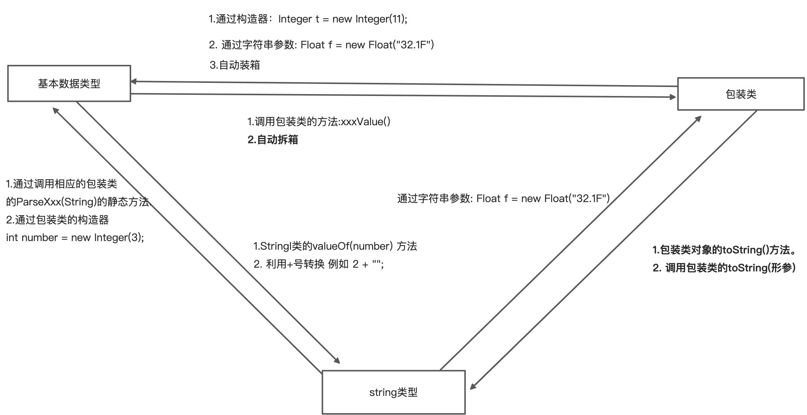

- equals():boolean
  \- 说明Object类中定义的equals() 和 == 的作用是相同的

String Date File 包装类等对equals方法进行了重写 重写后比较的不是两个引用地址是否相同，而是比较两个对象的尸体内容是否相同

```java
    public boolean equals(Object obj) {
        return (this == obj);
    }
```

String重写的equals方法

```java
    public boolean equals(Object anObject) {
        if (this == anObject) {
            return true;
        }
        if (anObject instanceof String) {
            String aString = (String)anObject;
            if (coder() == aString.coder()) {
                return isLatin1() ? StringLatin1.equals(value, aString.value)
                                  : StringUTF16.equals(value, aString.value);
            }
        }
        return false;
    }


------ StringLatin1的equlas方法
    public static boolean equals(byte[] value, byte[] other) {
        if (value.length == other.length) {
            for (int i = 0; i < value.length; i++) {
                if (value[i] != other[i]) {
                    return false;
                }
            }
            return true;
        }
        return false;
    }
------- StringUTF16的equlas方法
    public static boolean equals(byte[] value, byte[] other) {
        if (value.length == other.length) {
            int len = value.length >> 1; // >>1  ===> /2
            for (int i = 0; i < len; i++) {
                if (getChar(value, i) != getChar(other, i)) {
                    return false;
                }
            }
            return true;
        }
        return false;
    }
```

- toString()

```java
    public String toString() {
        return getClass().getName() + "@" + Integer.toHexString(hashCode());
    }
```


# 包装类

使得基本数据类型也能面向对象
**int ==> Integer**
short ===> Short
byte ===> Byte
longt ===> Long
float ===> Float
double ===> Double
boolean ===> Boolean
**char ===> Character**


```java
// 调用包装类的toString(形参)
String s = Integer.toString(13);
// 包装类对象的toString() 方法
Integer number = 13;
number.toString();
```

```java
// 调用包装类的方法:xxxValue()
Integer in1 = Integer.valueOf("123");
        int i = in1.intValue();
```


## JDK5.0新特性: 自动拆箱与自动装箱

**自动装箱： 基本数据类型 ===> 包装类**

```java
		// 自动装箱
        int i = 10;
        Integer integer = i;
```

自动拆箱： 包装类 ===> 基本数据类型

```java
// 自动拆箱
 Integer integer = 10;
int j = integer;
```

反编译之后

```java
   public static  void main(String[]args){
        Integer integer=Integer.valueOf(10);
        int i=integer.intValue();
    }
```

```java
public void test1() {
 Object o1 = true ? new Interger(1) : new Double(2.0);
    System.out.println(01) // 1.0 三元表达式会自动类型提升Interger成Double
}
```

**自动装箱都是通过包装类的 valueOf() 方法来实现的.自动拆箱都是通过包装类对象的 xxxValue() 来实现的。**

**valueOf()源码解析:**

```java
    public static Integer valueOf(int i) {
        if (i >= IntegerCache.low && i <= IntegerCache.high)
            return IntegerCache.cache[i + (-IntegerCache.low)];
        return new Integer(i);
    }
```

IntegerCache:

```java
    private static class IntegerCache {
        static final int low = -128;
        static final int high;
        static final Integer cache[];

        static {
            // high value may be configured by property
            int h = 127;
            String integerCacheHighPropValue =
                VM.getSavedProperty("java.lang.Integer.IntegerCache.high");
            if (integerCacheHighPropValue != null) {
                try {
                    int i = parseInt(integerCacheHighPropValue);
                    i = Math.max(i, 127);
                    // Maximum array size is Integer.MAX_VALUE
                    h = Math.min(i, Integer.MAX_VALUE - (-low) -1);
                } catch( NumberFormatException nfe) {
                    // If the property cannot be parsed into an int, ignore it.
                }
            }
            high = h;

            cache = new Integer[(high - low) + 1];
            int j = low;
            for(int k = 0; k < cache.length; k++)
                cache[k] = new Integer(j++);

            // range [-128, 127] must be interned (JLS7 5.1.7)
            assert IntegerCache.high >= 127;
        }

        private IntegerCache() {}
    }
```


# Integer缓存机制

Integer内部定义了IntegerCache结构 IntegerCache中定义了Integer\[];
保存了从-128～127范围的整数 如果使用自动装箱的方式 给Integer赋值的范围在-128～127中 可以直接使用数组中的元素 不需要再去new 从而提高效率
