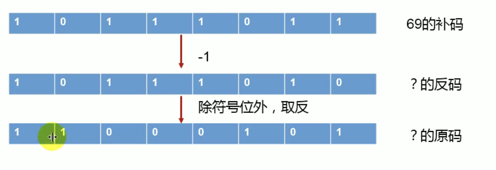

DAO： data(base) access object 操作数据库 <a name="ZwMCm"></a>

# 关键字和保留字

> 关键字 被java赋予了特殊含义 用于专门用途的字符串（关键字中的所有字母都是小写）
> 保留字：现在的版本未使用 但以后的版本可能会被用于关键字的字符串 命名标识符要避免使用保留字

```java
goto const
```

<a name="xLzgM"></a>

# 标识符

变量 方法 类等命名使用的字符串序列称为标识符
&#x20;标识符规则：

- 数字 字母 \_ 或者$组成
- 不能以数字开头
- 不可以使用关键字和保留字
- 严格区分大小写 长度无限制
- 标识符不能包含空格 <a name="ATm2s"></a>

# 命名规范

包名 所有单词小写
类名 接口名 所有单词首字母大写
变量名 方法名 驼峰命名
常量名 所有字母大写

```java
int age = 12; //变量的定义
int number; //变量的声明
number = 123; //变量的赋值
```

bit 计算机中中最小的存储单位（只存0或者1）
byte：计算机中基本存储单元
**1字节= 8bit**

<a name="y5dyF"></a>

## 编码

**ASCII码**：
**UTF-8 **：是使用最广的一种Unicode的实现方式 <a name="ftBkA"></a>

## 二进制

二进制最高位为符号位  0代表正数 1代表负数

- 原码
- 反码
- 补码

正数的 原码 反码 补码 都是一个
负数的 反码为原码除符号位之外 各个位置取反 补码等于反码加1
**计算机底层都以补码存储数据**
 <a name="LkNGD"></a>

## switch-case

switch结构中的表达式 只能是byte short char int 枚举类型 String类型
