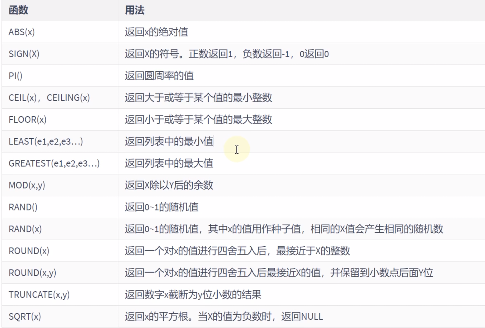
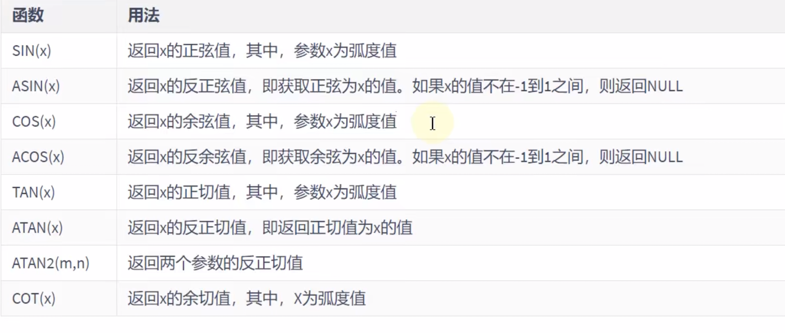
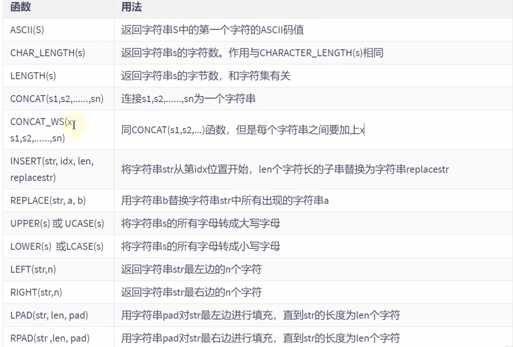
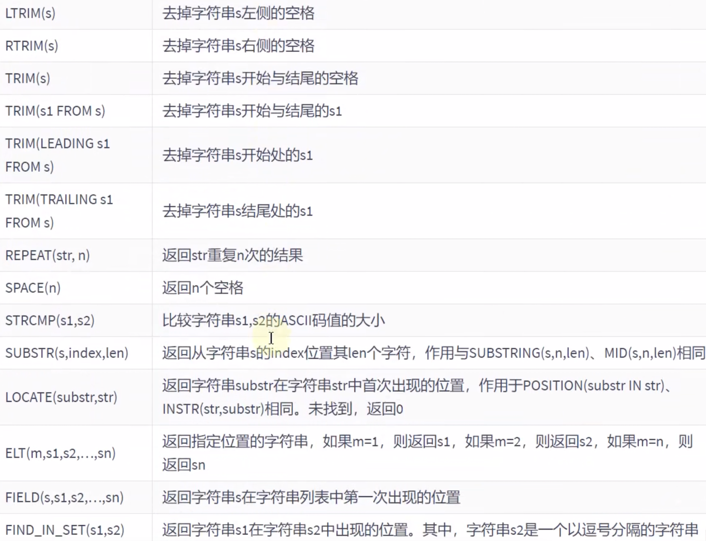
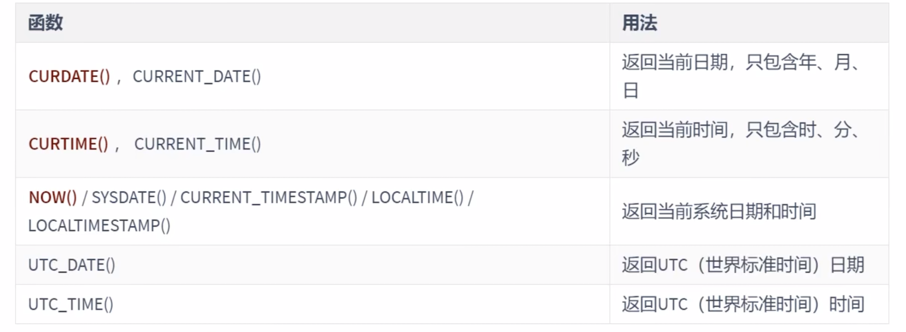
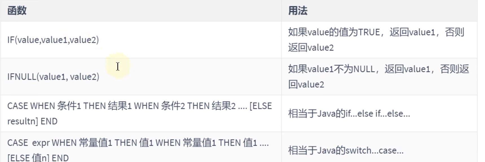
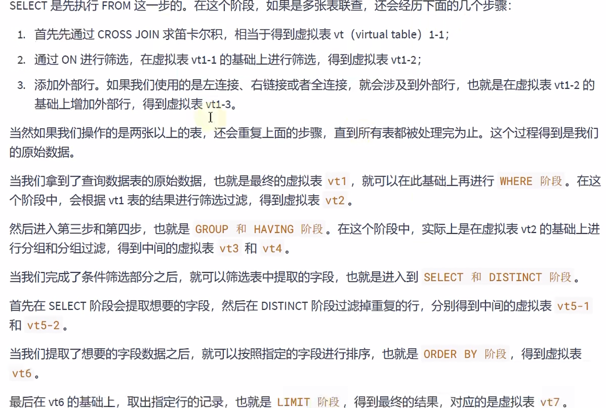

# 单行函数

- 操作数据对象
- 接受参数返回一个结果
- 只对一行进行变换
- 每行返回一个结果
- 可以嵌套
- 参数可以是一列或者是一个值

## 基本函数



## 三角函数



## 弧度与角度变换的函数


## 进制换转换函数


```sql
#  CONV函数 第一个参数表示在第二个参数里面的值 然后在控制台输出的是转换为第三个参数的值
select conv(10,2,10) from dual;
```


# 字符串函数

> **字符的索引是从1开始的**



> UTF8占3个字节
> LPAD 能够进行右对其
> RPAD 进行左对齐

mysql的字符串大小写一般不区分



# 时间 日期函数

> date: 2022-01-01
> time: 22:22:22


## 获取日期 时间：



## 时间戳和日期的转换


## 获取月份 星期 星期数 天数等函数

> 如果在函数中字符串符合date的默认格式 则填写字符串会发生隐式转换


```sql
select year('2022-02-05'),
       month('2022-02-05'),
       day('2022-02-05'),
       hour('22:31:53'),
       minute('22:31:53'),
       second(35)
from dual;
```


## 日期的操作函数


## 时间和秒钟的转换行数


## 计算日期和时间的函数


type的取值：


注意有下划线的地方：

```sql
select date_add('2022-02-02 22:22:22', interval '1_1' year_month ) from dual;
```


```sql
select now(), subtime(now(), '1:1:1'), adddate(now(), '1:1:1')
from dual;
```


## 日期和格式化解析

格式化： 日期 ===> 字符串
解析 字符串 ===> 日期

> 注意这里是显式的格式化解析


fmt参数的常用的格式符：


GET\_FORMAT的date\_type 和 format\_type的取值如下：

> date一列为date的取值类型 USA JiS 为 format\_type的取值类型 最后一列为返回的格式化字符串


# 流程控制函数



```sql
# 查询部门号为 10 20 30 的员工以及打印其工资的倍数

select salary,
       employee_id,
       case
           when employees.department_id = 10 then employees.salary * 1.1
           when employees.department_id = 20 then employees.salary * 1.2
           when employees.department_id = 30 then employees.salary * 1.3
           else employees.salary * 1.4 end 'detail'
from employees,
     departments
where employees.department_id = departments.department_id and employees.department_id in (10,20,30);
```


# 加密与解密函数


> password() 在 sql8.0中弃用了


# mysql的信息函数


# 其他函数


# 字符串转数字的几种方法

```sql
# 字符串转数字的几种方法
select convert('123', signed) - convert('3',signed ) from dual;

select '123' + 0 - '3' from dual;
```


# demo

```sql
# 显示系统时间 日期+时间
select now(),sysdate(),current_timestamp(),localtime(),localtimestamp()
from dual;

# 查询员工号 姓名 工资 以及工资提高20%后的结果 new salary
select department_id, last_name, salary, salary * 1.2 'new salary'
from employees;


# 将员工的姓名按首字母排序 并写出姓名的长度
select last_name, length(last_name) 'length'
from employees
order by last_name;

# 查询员工的id last_name salary 并且作为一个列出书 别名为out_put
select concat_ws('-', employee_id, last_name, salary) 'out_put'
from employees;

# 查询公司各个员工工作的年数  工作的天数 并且按工作年数的降序进行排序
select date_format(current_date(), '%Y') + 0  - date_format(hire_date, '%Y') 'year',
       datediff(current_date(),hire_date) 'days',
       hire_date,
       date_format(hire_date, '%Y'),
       date_format(current_date(), '%Y')
from employees
order by year desc;


# 查询员工姓名 hire_date department_id
select last_name, department_id, hire_date
from employees
where date_format(hire_date, '%Y') > '1997' # 显式的转换操作
  # hire_date > '1997' # 这里存在隐式转换
  # hire_dare > str_to_format('1997-01-01',%Y-%m-%d) # 显式转换操作 日期=> 字符串
  and department_id in (80, 90, 110)
  and commission_pct is not null;

select strcmp(date_format(hire_date, '%Y'), '1997')
from employees;

# 入职超过10000天的员工姓名 入职时间
select last_name, hire_date
from employees
where datediff(current_date(), hire_date) > 10000;

```


# 多行函数


## 常用的聚合函数

聚合函数：是进行汇总的函数 输入的是一组数据的集合 输出的是单个值

- AVG
- SUM
- MAX
- MIN
- COUNT 等等

```sql
select avg(salary), sum(salary)
from employees;

# 字符串求和没有任何意义
# avg sum只适用于数值类型的字段 (这些都会过滤null值)
select sum(last_name)
from employees;

# 适用于数值类型 字符串类型 日期类型的字段（或者变量）
select max(last_name), min(last_name)
from employees;


# count 计算指定的字段在查询结构中出现的次数
# 查询一个字段 则是出现了多少次就是count的值 与字段的值无关（计算的是字段类型的个数）
# 计算表中有多少条记录
# count(*)
# count(1)
# count(具体的字段不一定对)： count计算的值不包含null值 如果为null 则不参与计算
# avg = sum / count
select count(salary * 2), count(employee_id), count(salary), count(2), count(*)
from employees;

# 求公司的平均奖金率
select avg(commission_pct)
from employees;
# 错误写法 因为 没有奖金率的没有计算在内 == sum(commission_pct) / count(commission_pct)

# 应该这样计算
select sum(commission_pct) / count(*)
from employees;
```


## Group by

分组函数的使用

- select的出现的非组函数的字段应出现在group by中

```sql
select job_id,avg(salary) from employees group by job_id; //salary需要用分组函数 直接用salary会出现问题
```


### with rollup

```sql
# with rollup 会在所有的查询出的分组记录之后添加一条记录 该记录查询出所有记录的总和
# 使用rollup 的时候 不能使用order by 这两个是互斥的
select department_id,avg(salary) from employees where department_id > 80 group by department_id with rollup
```


## having

在where中不能使用聚合函数 因此 在group by中 如果要增加条件过滤的条件 需要使用 having关键字 having关键字需要声明在group by的后面

> 如果没有写group by  而是直接写having 不会报错 但是 所有的数据都是一组 使用having 条件过滤意义不大
> 在 HAVING 子句中使用无聚合条件可能会导致效率低下。可以考虑将它们移至 WHERE 中

有聚合函数 必须写在having中 没有聚合函数的条件写在where中

> 在没有聚合函数的时候 where的执行效率要比having高


# where和having的对比


# sql执行的顺序:

> from => on(left / right  join) =>where => group by => having => select的字段 => destinct => order by => limit
> sql的每个过程都会有一个虚拟表


