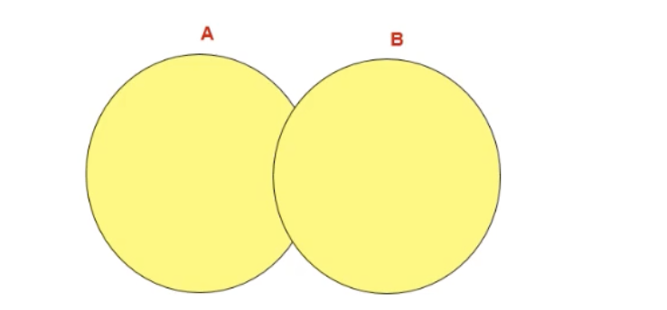
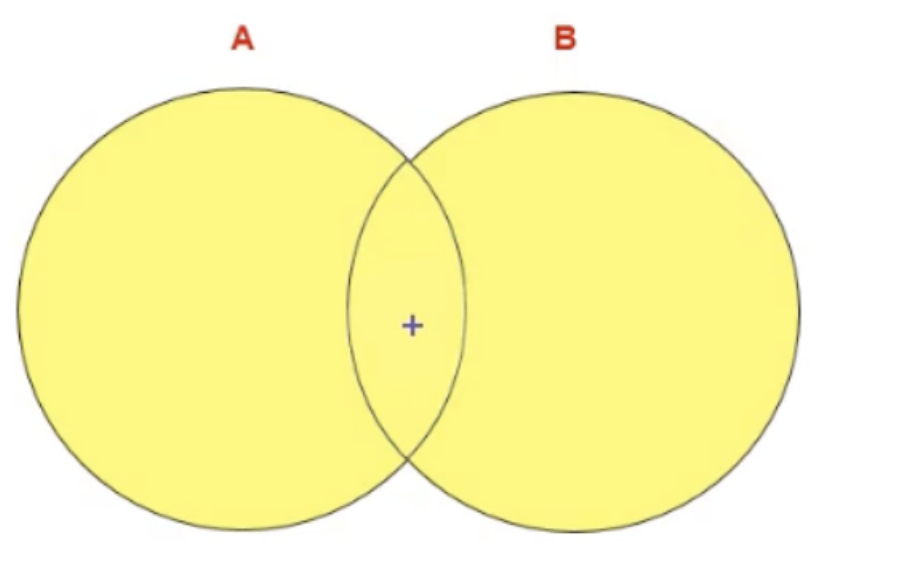

> 多表关联查询 操作不当（缺少了多表的连接条件）会引起笛卡尔积的错误
> cross join 交叉连接

```sql
select employee_id,department_name
from departments,employees;
# 这两个sql等同
select employee_id,department_name
from departments cross join employees;
```

> 多表查询需要有连接条件

```sql
select employee_id,department_name
from departments,employees
where departments.department_id = employees.department_id;

select employee_id,department_name
from departments cross join employees
where departments.department_id = employees.department_id;
```

笛卡尔积的错误会在下面条件产生

- 省略多个表的连接条件(关联条件)
- 连接条件（关联条件）无效
- 所有表中的所有行互相连接

避免笛卡尔积的错误 可以在where 加入有效的连接条件

> 如果查询的语句中出现了多个表都存在的字段 则select 字段时需要指名此字段所在的表
> 从sql优化的角度 建议多表查询时候 每个字段都指名其所在的表

```sql
select employees.employee_id,departments.department_name,employees.department_id,departments.department_id
from departments,employees
where departments.department_id = employees.department_id;
```

如果字段冗余过长 可以给表起别名 （给表起了别名 必须使用表的别名）

```sql
select emp.employee_id,dep.department_name,emp.department_id,dep.department_id
from departments as dep,employees as emp
where dep.department_id = emp.department_id;

```

如果又n个表实现多表的查询 则至少需要n-1 个关联条件

# 笛卡尔积（交叉连接）

笛卡尔积是数学运算 如果有两个集合 x 和 y 那么x 和 y的笛卡尔积就是x 和y的所有可能的组合。组合的个数即为两个集合元素的个数的乘积

> 笛卡尔发明了直角坐标系


# 多表查询的分类


## 等值连接 非等值连接


## 自连接 非自连接

> 自连接 相当于表自我引用的例子

```sql
select emp.employee_id, emp.last_name,mgr.employee_id,mgr.last_name
from employees emp, employees mgr
where emp.manager_id = mgr.employee_id
```


## 内连接 外连接

内连接： 合并具有同一列的两个以上的表的行 结果集中不包含一个表和另外一个表不匹配的行
外连接： 合并具有同一列的两个以上的表的行 结果集中包含一个表和另外一个表不匹配的行之外 还查询到了左表 或 右表中不匹配的行
外连接的分类：

- 左外连接 两个表在连接过程中除了返回满足连接条件的行以外还返回**左表**中不满足的行 称为左外连接  则连接条件中左边的表称为**主表** 右边的表称为**从表**
- 右外连接 两个表在连接过程中除了返回满足连接条件的行以外还返回**右表**中不满足的行 称为右外连接 则连接条件中右边的表称为**主表** 左边的表称为**从表**
- 满外连接

# SQL92 实现内连接

```sql
select emp.employee_id, emp.last_name, mgr.employee_id, mgr.last_name
from employees emp,
     employees mgr
where emp.manager_id = mgr.employee_id;
```


## SQL92 实现外连接

> sql92 实现外连接： 使用+
> Mysql 不支持SQL92 语法中外连接的写法 --- 也就是+号的写法


# SQL99 语法 实现内连接

> SQL99 语法中使用JOIN ...ON的方式实现多表的查询

```sql
select last_name, department_name
from employees e
         join departments d on d.department_id = e.department_id
```

> 这里相当于还省略了一个 inner 完整写法

```sql
select last_name, department_name
from employees e
        inner join departments d on d.department_id = e.department_id
```


# SQL99 语法 实现外连接

实现左外连接

```sql
# 查询所有的员工的last_name, department_name信息 则需要考虑外连接
select last_name, department_name
from employees e
        left outer join departments d on d.department_id = e.department_id
```

> 这里的outer 可以省略 可以直接写成left join

右连接就是 right Join

```sql
select last_name, department_name,d.department_id
from employees e
         right join departments d on d.department_id = e.department_id;
```


```sql
# 7种join的实现
## 中图的实现
select employee_id,department_name
from departments join employees
where employees.department_id = departments.department_id;

## 左上图 左外连接的实现
select employee_id,department_name
from departments left join employees
on employees.department_id = departments.department_id;

## 左中图
select employee_id,department_name
from departments left join employees
on employees.department_id = departments.department_id
# 注意不要写成 employees.department_id = null；  null参与运算都是false
where employees.department_id is null;

## 右上图 右外连接的实现
select employee_id,department_name
from departments right join employees
on employees.department_id = departments.department_id;

## 右中图
select employee_id,department_name
from departments right join employees
on employees.department_id = departments.department_id
where departments.department_id is null;


# 左下图 全连接
## 第一种
select employee_id,department_name
from departments left join employees
on employees.department_id = departments.department_id
union all
select employee_id,department_name
from departments right join employees
on employees.department_id = departments.department_id
where departments.department_id is null;

## 第二种
select employee_id,department_name
from departments left join employees
on employees.department_id = departments.department_id
union
select employee_id,department_name
from departments right join employees
on employees.department_id = departments.department_id;

# 右下图
select employee_id,department_name
from departments left join employees
on employees.department_id = departments.department_id
where employees.department_id is null
union # [all]
select employee_id,department_name
from departments right join employees
on employees.department_id = departments.department_id
where employees.department_id is null;
```


# 满外连接

mysql 不支持 full outer join 满外连接的写法


# union 的使用


## 合并查询结果

利用union关键字 可以给出多条select语句 并将它们的结果组合成单个结果集 合并时 两个表对应的列数和数据类型必须相同 并且互相对应 各个select语句之间使用union或者union all关键字分隔
语法：

```sql
select column, ... from table1
union [all]
select column, ... from table2
```


## UNION操作


返回两个查询的结果集的并集 去除重复记录


# UNION ALL 操作


union all 操作返回两个查询结果集的并集 对于结果集重复的部分 不去重

> 执行union all 语句时所需要的资源比union的语句少 如果明确知道合并数据后的结果数据不存在重复数据 或者不需要去除重复数据 则使用unionall 数据 以提高数据查询的效率


# sql99 新特性


## 自然连接

natural join 表示自然连接
SQL99 在SQL92的基础还是那个提供一些特殊的语法 比如natural join 用来表示自然连接 可以把自然连接理解为sql92中的等值连接 它会帮你自动查询两张连接表中所有相同的字段 然后进行等值连接

```sql
select employee_id,last_name,department_name
from employees e join departments d
on e.department_id = d.department_id
and e.manager_id = d.manager_id;

select employee_id,last_name,department_name
from employees e natural join departments d;
```


# using

与natural join 不同的是using制定了具体的相同的字段名名称&#x20;
使用join ... using 可以简化 join on 的等值连接

```sql
# using
select employee_id,last_name,department_name
from employees e  join departments d
using (department_id,manager_id);
```


# 小结：

表连接的约束条件的三种方式 where on using

- where 适用于所有关联查询
- on： 只能和join一起使用  只能写关联条件 虽然关联条件可以合并到where中和其他条件一起书写 分开写可读性好
- using 只能和join一起使用 而且要求两个关联字段在关联表中名称一致 而且只能表示关联字段值相等

> 超过三个表禁止join 需要join的字段 数据类型保持绝对一致 多表关联查询时 保证被关联的字段需要有索引
> 即使双表join也需要注意表索引 sql性能
